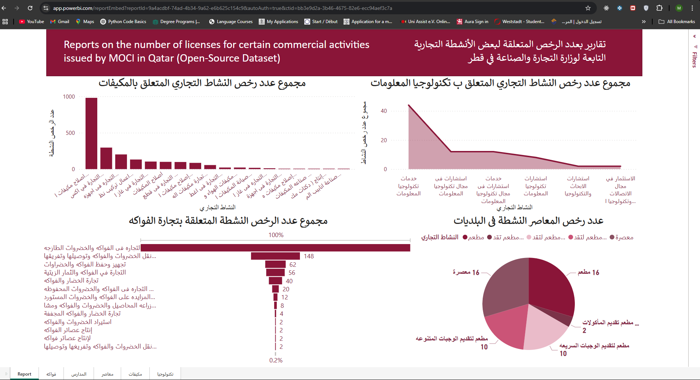

# Qatar Business Activity Analysis - Power BI Project

## 📊 Project Overview

This Power BI project explores and analyzes active commercial certificates (Licenses) in the State of Qatar, categorized by **municipality** and **business activity**. The dataset, sourced from the official [Qatar Open Data Portal](https://www.data.gov.qa), offers insights into business distribution and trends across different regions and sectors in Qatar.

## 🗂️ Dataset

**Source**: [Active Commercial Certificates by Municipality and Business Activity](https://www.data.gov.qa/explore/dataset/moci-active-certificates-by-municipality-and-business-activity/table/)

- **Publisher**: Ministry of Commerce and Industry (Qatar)
- **License**: Open Government License - Qatar
- **Attributes**:
  - Municipality
  - Business Activity (in Arabic and English)
  - Number of Active Commercial Certificates
 

## 💡 Usage

- Open `No_of_Licenses_MOCI.pbix` in **Power BI Desktop**.
- Review and explore the visualizations, or customize them for further insight.
- Use the Excel dataset to extend or update analysis as new data becomes available.

**Author**: *Mohamad Kaser*

**Data & BI Engineer** | M.Sc. in Computer Science

**Last Updated**: June 2025
